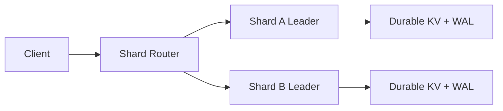

# Architecture Notes

## System overview

This project evolves from a simple in-memory key-value service into a distributed storage system with replication and shard-aware routing.

## Core layers

### Storage engine

- `internal/store` implements a concurrency-safe in-memory key-value map.
- `internal/persistence` wraps that map with a write-ahead log so writes survive restarts.

### Consensus layer

- `internal/raft` models the pure Raft state machine.
- It handles roles, terms, voting, append logic, commit advancement, and log application tracking.

### Node transport

- `internal/raftnode` exposes the Raft RPC surface over HTTP.
- Nodes can campaign for leadership, replicate entries, apply committed writes, and expose status and metrics.

### Shard routing

- `internal/sharding` implements a consistent hash ring.
- `internal/router` routes client keys to the leader of the shard selected by that ring.

## Why these design choices

### Why Raft

Raft is easier to explain and implement incrementally than Paxos while still delivering leader-based consensus, log replication, and fault-tolerant coordination.

### Why a WAL

The write-ahead log makes writes durable before they are acknowledged. That gives crash recovery and establishes the pattern we later rely on for replicated logs.

### Why a pure state machine first

Consensus logic is hard enough on its own. Isolating it from transport lets us test election and replication rules deterministically before debugging network behavior.

### Why consistent hashing

Consistent hashing lets the system scale beyond a single replicated keyspace without remapping every key when shards change.

## Current limitations

- Leader election is manually triggered through `/admin/campaign`
- Shards are currently configured statically
- Metrics are simple counters rather than a full Prometheus integration package
- Snapshotting and log compaction are not implemented yet
- Multi-node shard groups are not yet orchestrated in Docker Compose

## What I would do next

1. Add automatic election timers and heartbeats.
2. Replace HTTP Raft RPCs with protobuf-backed gRPC.
3. Add snapshots and follower catch-up.
4. Expand Compose into multi-node shard groups.
5. Add Prometheus and Grafana for full observability.

